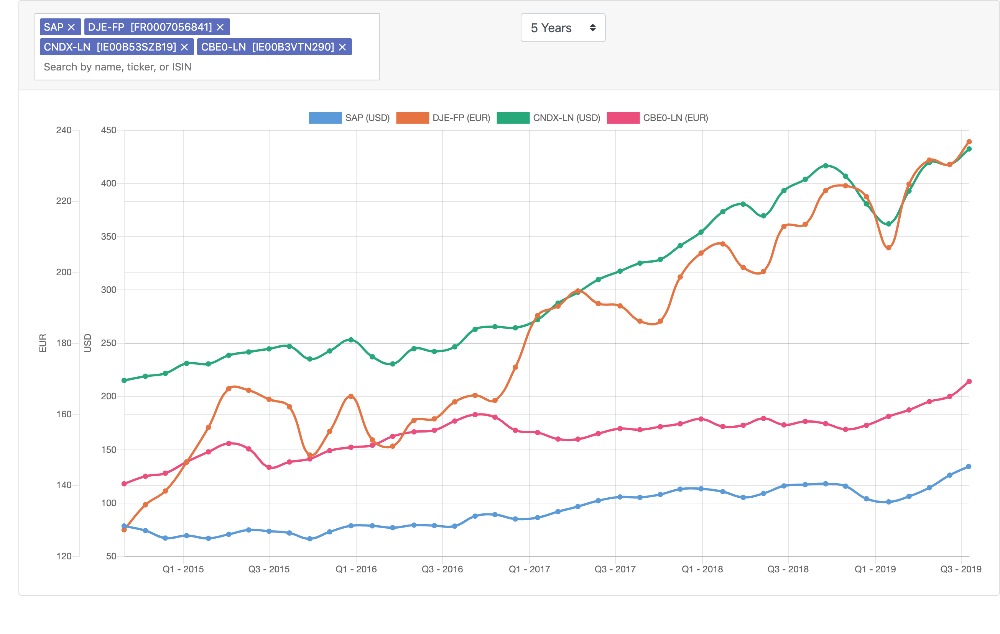

# Stockwatch

Stockwatch is a simple financial analysis tool to compare the performances of your stocks and securities.



It allows you to easily search for securities by symbol or ISIN and plot them all
in a single chart for easy comparison. It supports different currencies and time ranges.

## Data source

Stockwatch uses the [IEX Cloud API](https://iexcloud.io/) to retrieve financial data.

## Installation and Set-up

You will need to [sign up with IEX Cloud](https://iexcloud.io/cloud-login#/register/) and obtain an API token (yes, they do have a rather generous free access plan).

Other prerequisites:

* Ruby 2.6.2 or higher
* Yarn and NPM
* Docker

After having cloned the repository and obtained an API token, do the following:

* Run: `./bin/bundle`
* Run: `yarn`
* Run `EDITOR=<YOUR_FAVORITE_EDITOR> ./bin/rails credentials:edit` and add your IEX Cloud api token like here:
  ```
  iex:
    access_token: <YOUR_IEX_CLOUD_API_TOKEN>
  ```
* Start the database with: `docker-compose up`
* Run `./bin/rails iex:init` to fetch the financial symbols from IEX Cloud. This might take a while.
  The sets of symbols that will be fetched are configured in `config/iex.yml` as a list of API endpoints.
  You can modify the list, and you can work your way through the available API endpoints with symbols [here](https://iexcloud.io/docs/api/#reference-data). Be aware that there is a lot of overlap between different sets.

Finally, run `./bin/rails s` to start the server, and visit `localhost:3000` (It will take a while the fist time because Webpack needs to compile the front-end assets).


